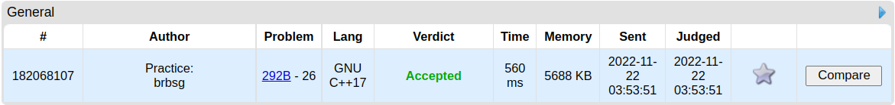
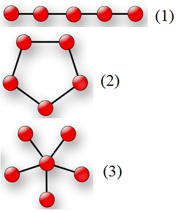

# 1. Submissão

- [Link da submissão](https://codeforces.com/contest/292/submission/182068107)



# 2. Problem - B. Network Topology

- [Link do problema](https://codeforces.com/problemset/problem/292/B)

This problem uses a simplified network topology model, please read the problem statement carefully and use it as a formal document as you develop the solution.

Polycarpus continues working as a system administrator in a large corporation. The computer network of this corporation consists of n computers, some of them are connected by a cable. The computers are indexed by integers from 1 to n. It's known that any two computers connected by cable directly or through other computers

Polycarpus decided to find out the network's topology. A network topology is the way of describing the network configuration, the scheme that shows the location and the connections of network devices.

Polycarpus knows three main network topologies: bus, ring and star. A bus is the topology that represents a shared cable with all computers connected with it. In the ring topology the cable connects each computer only with two other ones. A star is the topology where all computers of a network are connected to the single central node.

Let's represent each of these network topologies as a connected non-directed graph. A bus is a connected graph that is the only path, that is, the graph where all nodes are connected with two other ones except for some two nodes that are the beginning and the end of the path. A ring is a connected graph, where all nodes are connected with two other ones. A star is a connected graph, where a single central node is singled out and connected with all other nodes. For clarifications, see the picture.



You've got a connected non-directed graph that characterizes the computer network in Polycarpus' corporation. Help him find out, which topology type the given network is. If that is impossible to do, say that the network's topology is unknown.

## 2.1. Input

The first line contains two space-separated integers n and m (4 ≤ n ≤ 105; 3 ≤ m ≤ 105) — the number of nodes and edges in the graph, correspondingly. Next m lines contain the description of the graph's edges. The i-th line contains a space-separated pair of integers xi, yi (1 ≤ xi, yi ≤ n) — the numbers of nodes that are connected by the i-the edge.

It is guaranteed that the given graph is connected. There is at most one edge between any two nodes. No edge connects a node with itself.

## 2.2. Output

In a single line print the network topology name of the given graph. If the answer is the bus, print "bus topology" (without the quotes), if the answer is the ring, print "ring topology" (without the quotes), if the answer is the star, print "star topology" (without the quotes). If no answer fits, print "unknown topology" (without the quotes).

## 2.3. Examples

### Input

```
4 3
1 2
2 3
3 4
```

### Output

```
bus topology
```

### Input

```
4 4
1 2
2 3
3 4
4 1
```

### Output

```
ring topology
```

### Input

```
4 3
1 2
1 3
1 4
```

### Output

```
star topology
```

### Input

```
4 4
1 2
2 3
3 1
1 4
```

### Output

```
unknown topology
```

# 3. Instalação

- **Linguagem**: C++<br>

## 3.1. Requisito

- Compilador C++

## 3.2. Uso

- Compile o código da solução do problema com o comando abaixo:

  ```
  $ g++ solution.cpp -o prog
  ```

- Por fim, execute a solução e teste os casos presentes na :

  ```
  $ ./prog
  ```
